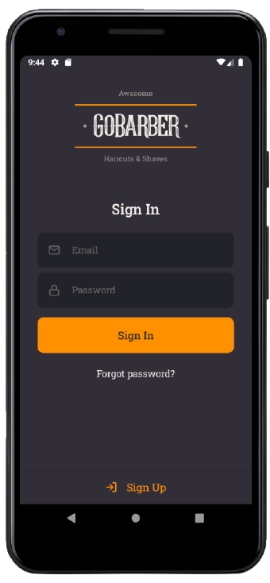
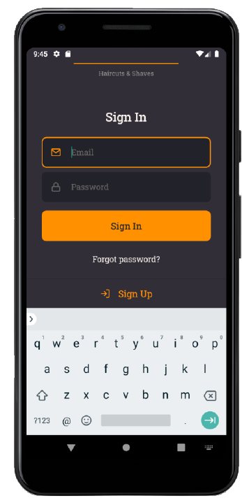
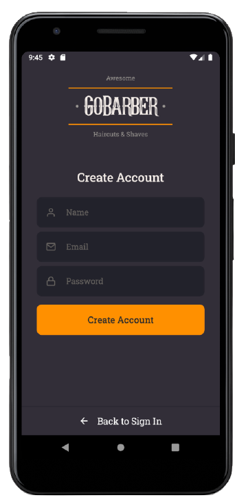
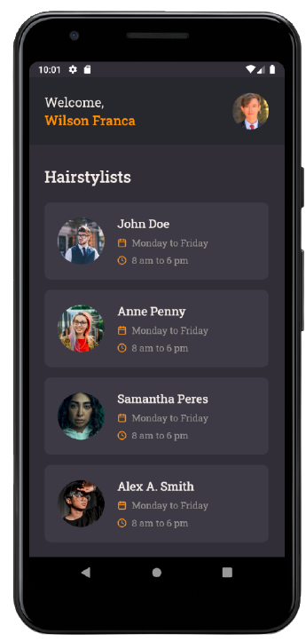
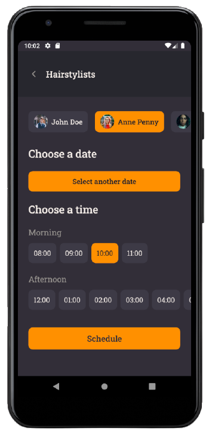
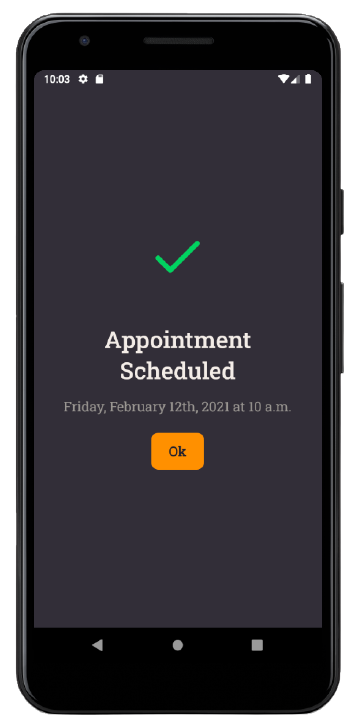

<p align="center">
  
  <a href="https://github.com/wilsonfsouza/happy-frontend-web/commits/main">
    
  </a>

   


  <a href="https://www.linkedin.com/in/wilsonfsouza/">
    
  </a>
</p>

<h1 align="center">
    GoBarber app
</h1>

<h4 align="center">
  Table of contents
</h4>

<p align="center">
 <a href="#-about-the-project">About</a> •
 <a href="#user-content-️-features">Features</a> •
 <a href="#-layout">Layout</a> •
 <a href="#-how-to-run-the-project">How to run</a> •
 <a href="#-technologies">Technologies</a> •
 <a href="#-author">Author</a> •
 <a href="#user-content--license">License</a>
</p>


## 💻 About the project

GoBarber is a mobile application made for clients to schedule an appointment with their favorite hairstylists and barbers.

By signing up, clients have access to a dashboard showing available hairstylists and barbers registered in the shop, allowing them to schedule appointments.

To see the **REST API**, click here: [GoBarber REST API](https://github.com/wilsonfsouza/gobarber-rest-api)<br />
To see the **web client**, click here: [GoBarber Web](https://github.com/wilsonfsouza/gobarber-frontend-web)

---

## ⚙️ Features

The app was designed to be used by clients to schedule appointments with barbers and hairstylists.


Don't need authentication:
- Create a new account

- Login

Need Authentication:

- Dashboard listing barbers and hairstylists registered in the shop

- Schedule an appointment with a provider

- Profile screen with option to reset user information and password

---

## 🎨 Layout
<br />


<br />

### **Sign In & Sign Up:**
<br />

<p align="center" style="display: flex; align-item: center; justify-content: center;">
  
  
  
</p>

<br />

### **Dashboard & Schedule Appointment:**
<br />

<p align="center" style="display: flex; align-item: center; justify-content: center;">
  
  
  
</p>

<br />

### **Profile:**
<br />

<p align="center" style="display: flex; align-item: center; justify-content: center;">
  
</p>

<br />

---

## 🚀 How to run the project

### Requirements

Initial requirements:
[git](https://git-scm.com), [yarn](https://yarnpkg.com/), an emulator to run the app, and a code editor of your choice.


#### Running the mobile application

```bash
# Clone this repository
$ git clone https://github.com/wilsonfsouza/appbarbershop.git

# Access the folder in your terminal/cmd/cli
$ cd appbarbershop

# Install all dependencies
$ yarn install

# Make sure the file 'src/services/api.ts' have the IP to your API

# Start the app
## Android
$ yarn react-native run-android

## iOS - install dependencies
$ cd ios
$ pod install
$ cd ..
$ yarn ios
```

> Remember to use the rest api with it
---

## 🛠 Technologies

The following tools were used in this project:

#### **Website**  ([React Native](https://reactnative.dev/)  +  [TypeScript](https://www.typescriptlang.org/))

-   **[React Native](https://reactnative.dev/)**
-   **[React Native Vector Icons](https://github.com/oblador/react-native-vector-icons)**
-   **[React Navigation](https://reactnavigation.org/)**
-   **[Styled-components](https://styled-components.com/)**
-   **[Yup](https://github.com/jquense/yup)**
-   **[Jest](https://jestjs.io/)**
-   **[Date-fns](https://date-fns.org/)**
-   **[UnForm](https://unform.dev/)**
-   **[Axios](https://github.com/axios/axios)**
-   **[Uuid](https://www.npmjs.com/package/uuidv4)**
-   **[ESLint](https://eslint.org/)**
-   **[Prettier](https://prettier.io/)**
-   **[EditorConfig](https://editorconfig.org/)**

> See the file  [package.json](https://github.com/wilsonfsouza/appbarbershop/blob/master/package.json)

#### [](https://github.com/wilsonfsouza/appbarbershop#utilities)**Utilities**

-   Editor:  **[Visual Studio Code](https://code.visualstudio.com/)**
-   Markdown:  **[Markdown Emoji](https://gist.github.com/rxaviers/7360908)**
-   Icons:  **[Feather Icons](https://feathericons.com/)**
-   Font-family:  **[Roboto](https://fonts.google.com/specimen/Roboto)**


---

## 💪 How to contribute to this project

1. **Fork** the project.
2. Start a new branch with your changes: `git checkout -b my-new-feature`
3. Save it and create a commit message describing what you have done: `git commit -m "feature: My new feature"`
4. Send your alterations: `git push origin my-feature`


---

## 👨‍💻 Author

<br/>
<h3>
 
 <br />
 <sub>Wilson Franca</sub></h3>
 <br />

[](https://www.linkedin.com/in/wilsonfsouza/)
[](mailto:wilson.franca.92@gmail.com)

---

## 📝 License

This project is being developed under [MIT License](./LICENSE).

Made with ❤️ by Wilson Franca 👋

